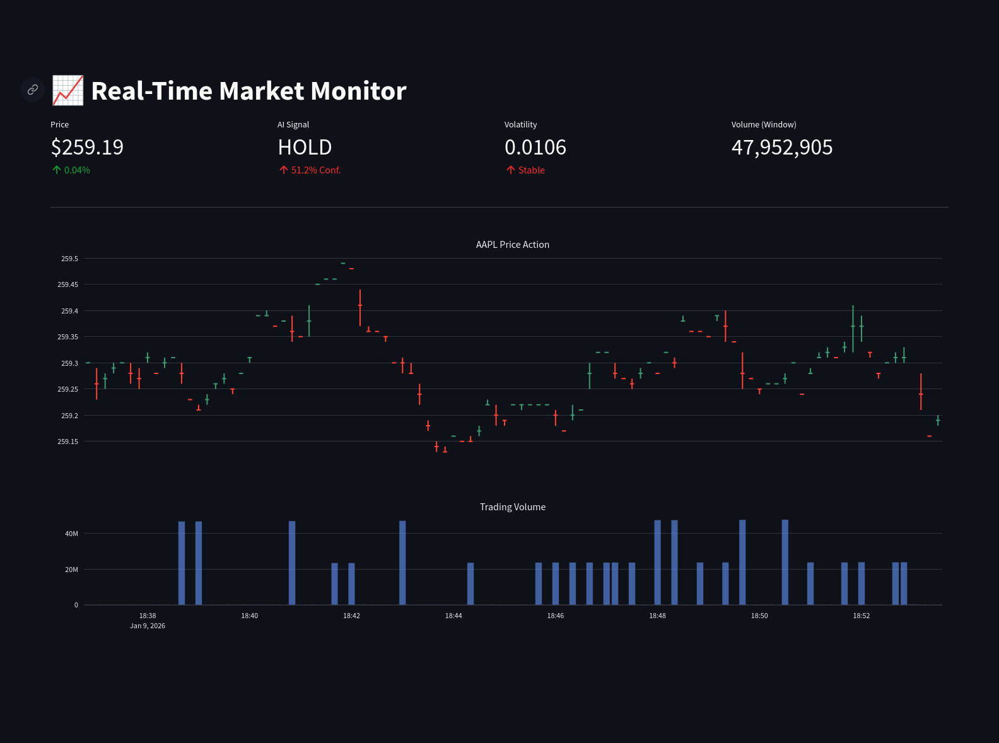
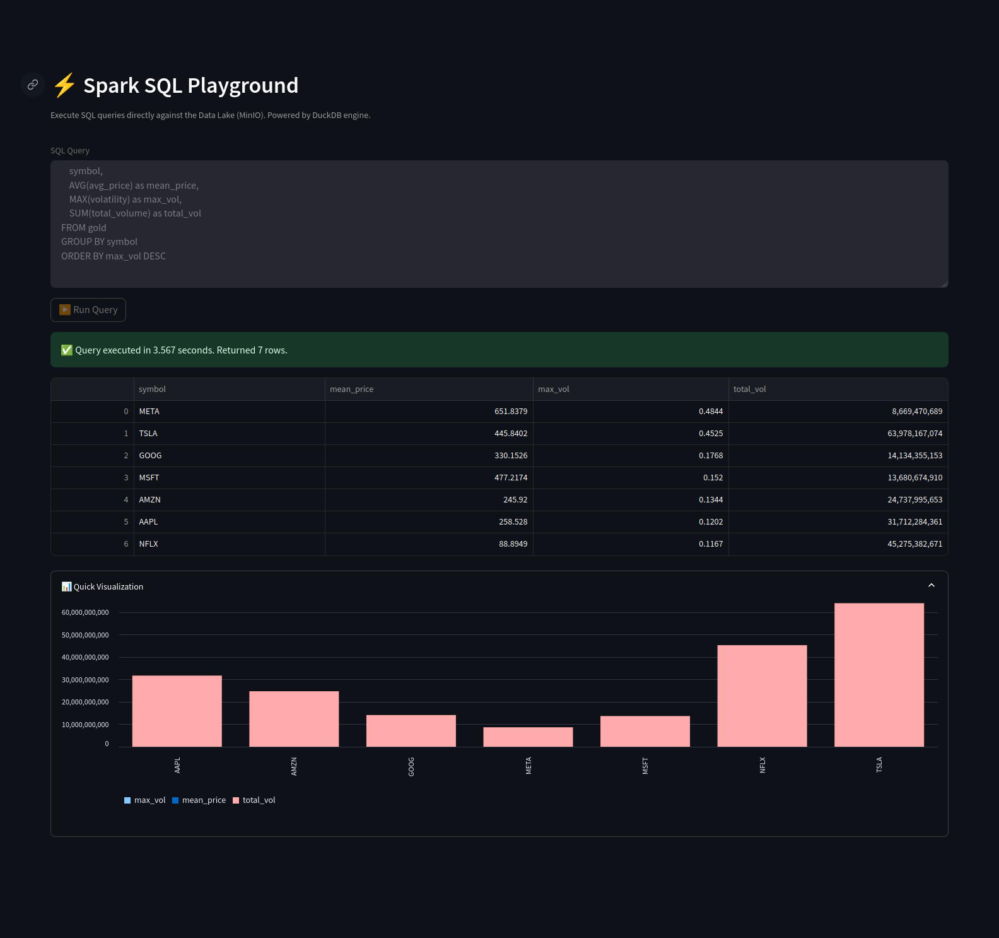
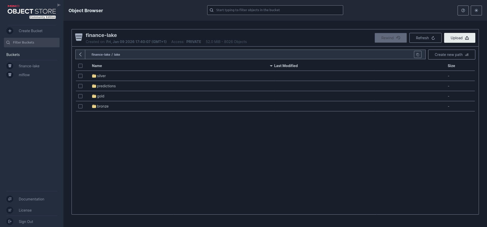

# ⚡ Real-Time Stock Insight & Prediction Platform

A scalable, end-to-end data engineering and machine learning platform that ingests real-time stock market data, processes it using Spark Structured Streaming & Delta Lake, and generates AI-driven price predictions using **Spark MLlib (Random Forest)**. Results are visualized in a live Streamlit dashboard.

---

## 🖼️ Dashboard Preview


_(Main dashboard view showing real-time price and signals)_


_(Detailed view of the terminal interface)_

---

## 🚀 Features

- **Real-Time Ingestion**: Fetches live stock data (Yahoo Finance/AlphaVantage) and pushes to **Redpanda (Kafka)**.
- **Lakehouse Architecture**: Implements a Medallion Architecture (Bronze used for raw, Silver for clean, Gold for aggregated) using **Delta Lake** on **MinIO (S3)**.
- **Spark Structured Streaming**: Stateful processing, watermark handling, and windowed aggregations.
- **Machine Learning**:
  - **Feature Engineering**: Real-time feature computation (Volatility, Log Returns) using native Spark functions.
  - **Model**: **Random Forest Classifier** implemented with **Spark MLlib** for robust price direction prediction.
- **Interactive Dashboard**: **Streamlit** app powered by **DuckDB** for low-latency queries on Delta tables.
- **Infrastructure as Code**: Entire stack dockerized with **Docker Compose**.

---

## 🛠️ Tech Stack

- **Ingestion**: Python, Kafka Producer
- **Message Broker**: Redpanda (Kafka compatible)
- **Processing**: Apache Spark 3.4 (Structured Streaming)
- **Storage**: MinIO (S3 compatible object storage)
- **Table Format**: Delta Lake 2.4
- **Machine Learning**: **Spark MLlib** (Random Forest)
- **Visualization**: Streamlit, Plotly, DuckDB
- **Containerization**: Docker, Docker Compose

---

## 🏗️ Architecture Overview

The pipeline follows a modern "Medallion" Lakehouse architecture:

1.  **Source**: `kafka_producer` fetches ticks and publishes to `stock_prices` topic.
2.  **Bronze Layer**: Spark reads Kafka, dumps raw bytes/json to Delta table (`s3a://finance-lake/lake/bronze`).
3.  **Silver Layer**: Deduplicates data, enforces schema, and cleans types (`s3a://finance-lake/lake/silver`).
4.  **Gold Layer**: Aggregates data into time windows (e.g., 1-minute candles) and calculates financial metrics (`s3a://finance-lake/lake/gold`).
5.  **Machine Learning**:
    - **Training**: Spark MLlib trains a Random Forest model on historical Gold data (`src/ml/train_rf.py`).
    - **Inference**: Real-time spark job consumes Gold data, predicts "BUY/SELL/HOLD", and writes to `predictions` table (`src/ml/stock_inference.py`).
6.  **Serving**: Streamlit connects to MinIO via DuckDB to serve the dashboard.

---

## ⚙️ Setup & Installation

### Prerequisites

- Docker & Docker Compose installed.
- (Optional) `git` installed.

### 1. Clone the Repository

```bash
git clone https://github.com/larbi-asmaoui/Real-Time-Stock-Insight-Spark.git
cd Real-Time-Stock-Insight-Spark
```

### 2. Configure Environment

The project comes with reasonable defaults. If you need API keys (e.g., for AlphaVantage), create a `.env` file (optional for Yahoo Finance):

```bash
cp .env.example .env
# Edit .env and add your keys if necessary
```

### 3. Start the Platform

Run the entire stack in detached mode:

```bash
docker-compose up -d
```

_Note: The first run may take a few minutes to build the Spark and Scraper images._

---

## 🖥️ Usage

### Accessing Services

| Service           | URL                     | Description                                 |
| :---------------- | :---------------------- | :------------------------------------------ |
| **Dashboard**     | `http://localhost:8501` | Main Streamlit UI                           |
| **MinIO Console** | `http://localhost:9001` | Object Storage UI (User/Pass: `minioadmin`) |
| **Redpanda**      | `localhost:8081`        | Schema Registry (if enabled)                |

### Triggering ML Training

To retrain the Random Forest model on the latest data:

```bash
docker exec -it spark-streaming python3 /app/src/ml/train_rf.py
```

### Checking Logs

To monitor the streaming process:

```bash
docker-compose logs -f spark-streaming
```

---

## 📂 Project Structure

```plaintext
├── docker-compose.yml       # Infrastructure definition
├── Dockerfile.spark         # Custom Spark image with Jars
├── Dockerfile.dashboard     # Streamlit app image
├── src/
│   ├── ingestion/           # Kafka Producers
│   ├── processing/          # Spark Structured Streaming Jobs
│   ├── ml/                  # Spark MLlib Random Forest (Train & Inference)
│   ├── dashboard/           # Streamlit App
│   └── debug_*.py           # Utilities for inspecting Delta tables
├── jars/                    # Spark dependencies (Delta, Kafka, Hadoop-AWS)
├── data/                    # Local mount for checkpoints
└── logs/                    # Application logs
```

---

## 📸 Additional Screenshots

### MinIO Data Lake Buckets


_(Bronze, Silver, and Gold data layers in MinIO)_

---

## 📄 License

Distributed under the MIT License. See `LICENSE` for more information.
